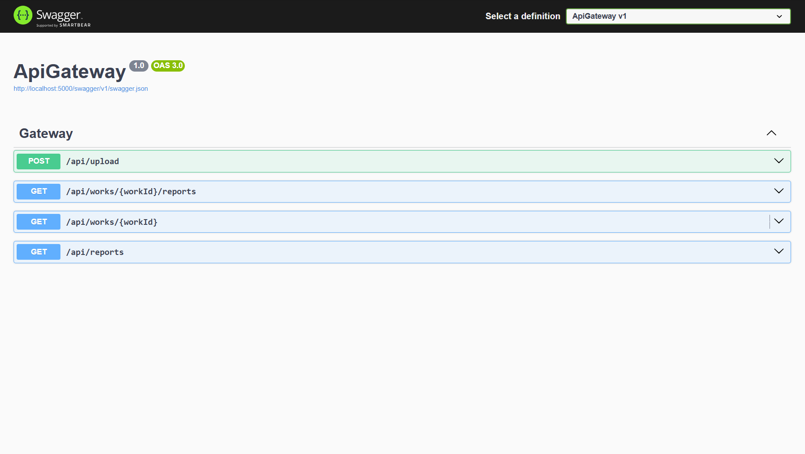
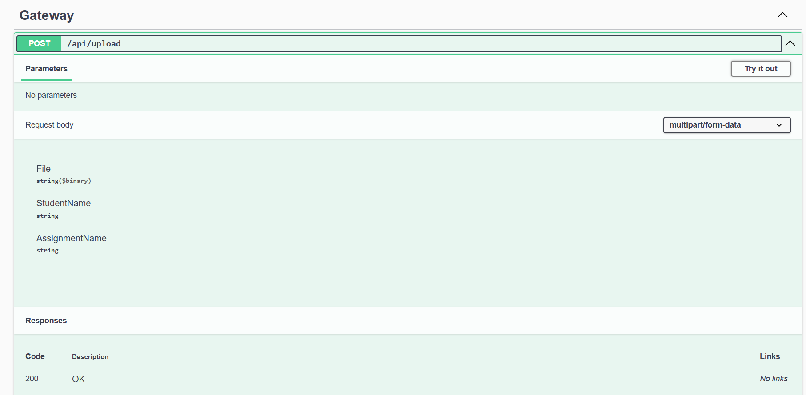
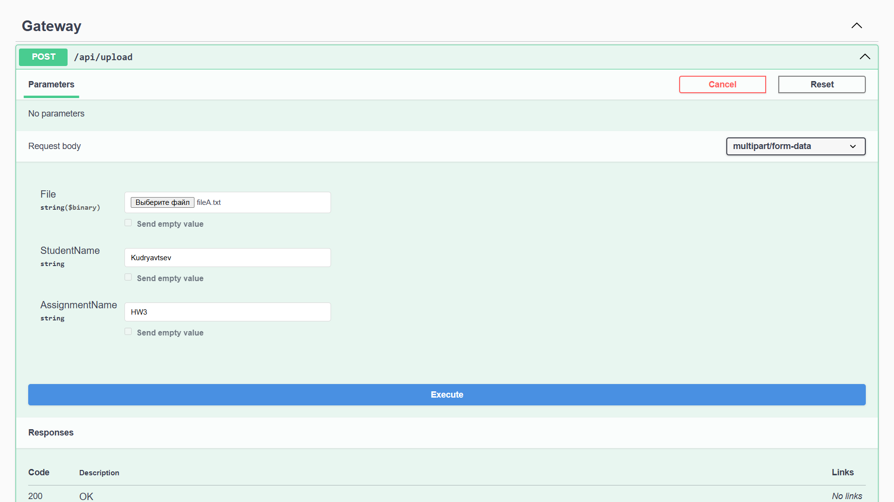
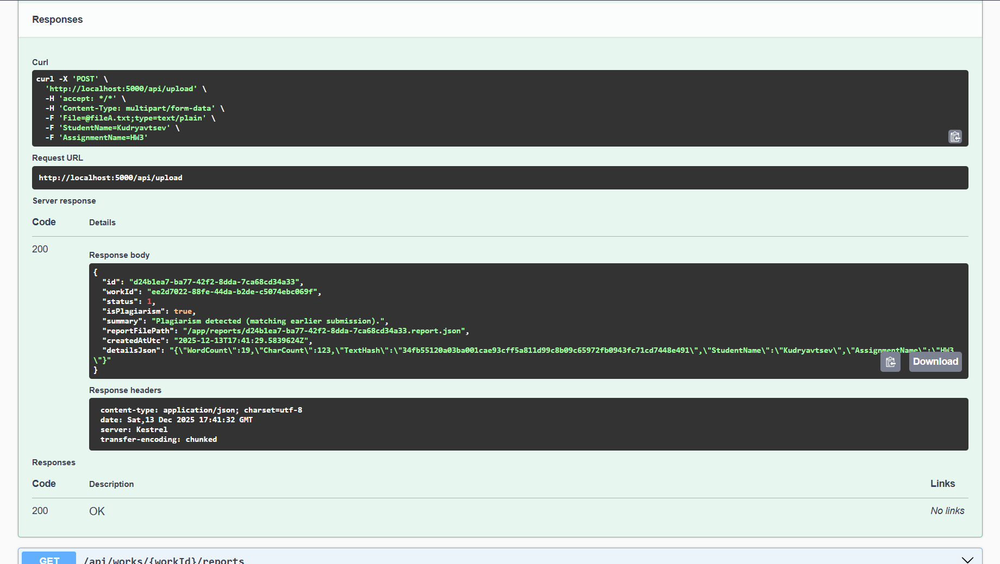
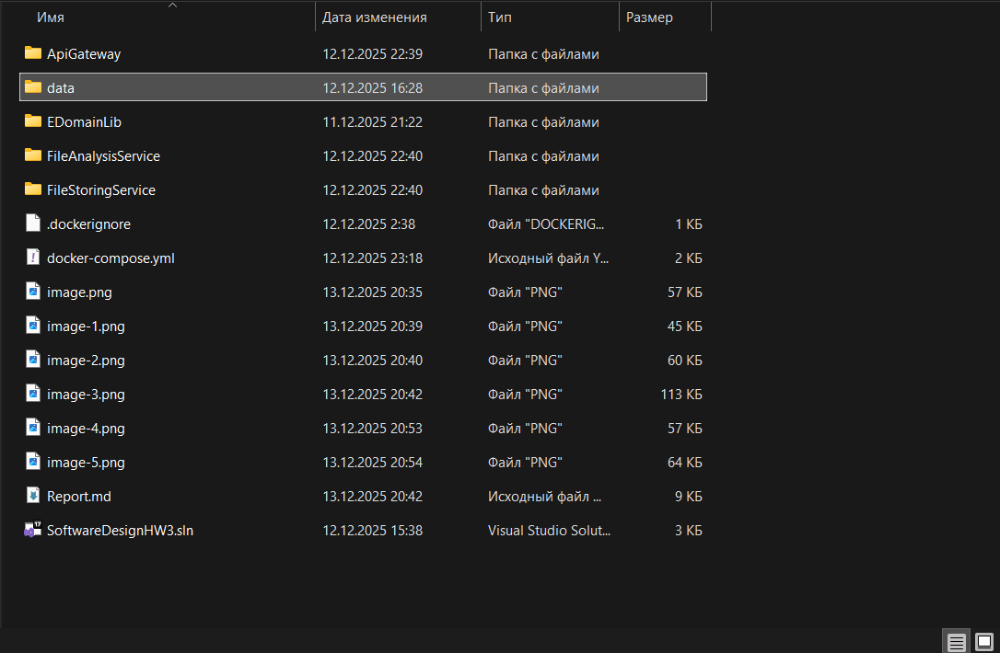
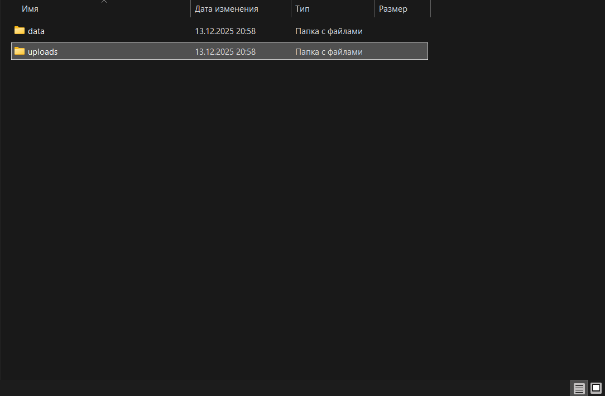
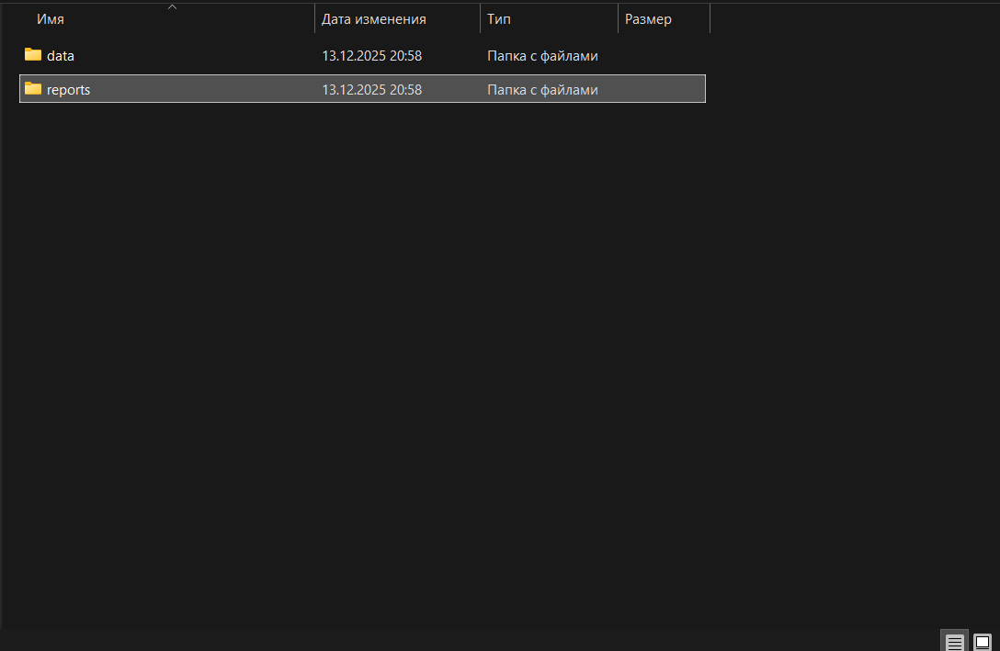
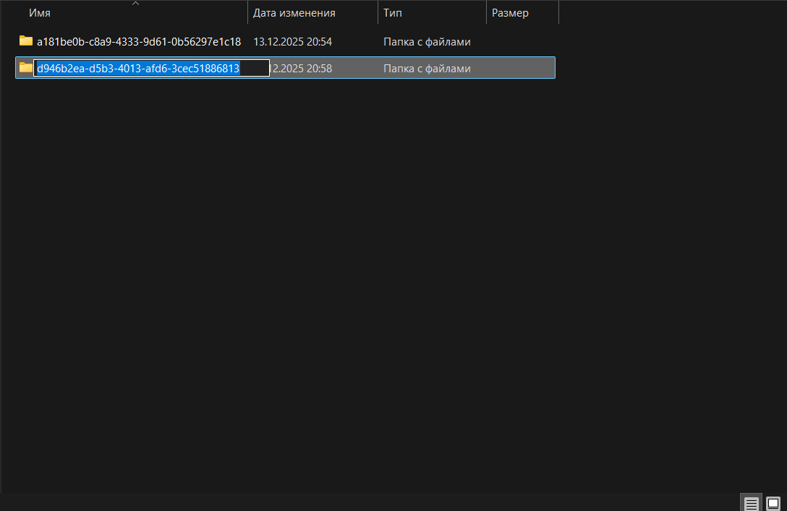
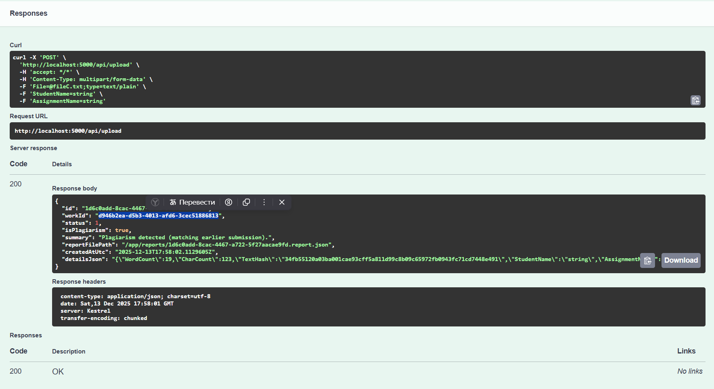

# Домашняя работа 3, Кудрявцев Георгий Александрович БПИ 245

## Краткое описание проекта

Данное приложение представляет собой **распределённую микросервисную систему**, предназначенную для:

- загрузки файлов студентов,
- сохранения информации о файлах,
- анализа содержимого файлов,
- формирования и получения отчетов по результатам анализа.

Система построена с использованием **микросервисной архитектуры**, **HTTP-взаимодействия**, **Docker-контейнеризации**, а также **Swagger** для документирования API.

---

## Функциональные требования (выполнение)

- Загрузка файлов через API - выполнено
- Хранение файлов и метаданных - выполнено
- Анализ загруженных файлов - выполнено
- Получение отчета по одной работе - выполнено
- Получение списка отчетов по работе - выполнено
- Получение всех отчетов в системе - выполнено
- API Gateway как единая точка входа - выполнено
- Использование Docker - выполнено
- Использование Swagger - выполнено

---

## Архитектура приложения

### Общая схема

Приложение состоит из **трех независимых сервисов**:

1. **ApiGateway**
2. **FileStoringService**
3. **FileAnalysisService**

Все сервисы:
- являются ASP.NET Core Web API приложениями,
- взаимодействуют друг с другом по HTTP,
- разворачиваются в отдельных Docker-контейнерах.

---

### 1. ApiGateway

**Назначение:**  
Единая точка входа в систему. Инкапсулирует взаимодействие с downstream-сервисами.

**Основные функции:**
- Прием файлов от клиента
- Проксирование запросов в FileStoringService
- Передача данных в FileAnalysisService
- Агрегация и возврат результатов

**Пример кода контроллера:**

```csharp
[HttpPost("upload")]
public async Task<IActionResult> Upload([FromForm] UploadProxyRequest request)
{
    ReportDto report = await _service.UploadAndAnalyzeAsync(
        request.File,
        request.StudentName,
        request.AssignmentName
    );

    return Ok(report);
}
```

**Архитектурные особенности:**

- Контроллеры не используют HttpClient напрямую
- Вся логика вынесена в GatewayService
- Используется IHttpClientFactory
- Четкое разделение ответственности

### 2. FileStoringService

**Назначение:**
Хранение файлов и метаданных о загруженных работах

**Функции:**

- Прием файлов
- Сохранение файлов на диск
- Вычисление SHA-256 хэша
- Сохранение информации в SQLite базе данных
- Получение информации о работе по ID

Пример кода сохранения в файл: 

```cs 
string folder = Path.Combine(_root, workEntity.Id.ToString());
Directory.CreateDirectory(folder);

string filePath = Path.Combine(folder, file.FileName);
using FileStream fs = new(filePath, FileMode.Create);
await file.CopyToAsync(fs);
```

**Используемые технологии:**
- Entity Framework Core
- SQLite
- Dependency Injection

### 3. FileAnalysisService

**Назначение:**
Анализ загруженных файлов и формирование отчетов.

**Функции:**

- Анализ работы на плагиат (сравнение на полное сходство с ранее загруженными работами)
- Формирование отчета
- Получение отчета по работе
- Получение всех отчетов в системе

## Сценарии взаимодействия с сервисом

### Загрузка работы
1. Клиент отправляет файл в ApiGateway
2. ApiGateway пересылает файл в FileStoringService
3. FileStoringService сохраняет файл и возвращает WorkDto
4. ApiGateway отправляет WorkDto в FileAnalysisService
5. FileAnalysisService возвращает ReportDto
6. ApiGateway возвращает результат клиенту

### Получение данных о загруженной работе
1. Клиент отправляет запрос на ApiGateway с идентификатором работы (workId)
2. ApiGateway принимает запрос и валидирует входные данные
3. ApiGateway перенаправляет запрос в FileStoringService
4. FileStoringService ищет информацию о работе в базе данных
5. FileStoringService возвращает данные о работе (WorkDto)
6. ApiGateway возвращает полученные данные клиенту

### Получение отчета о конкретной работе
1. Клиент отправляет запрос в ApiGateway с идентификатором работы (workId)
2. ApiGateway принимает запрос и перенаправляет его в FileAnalysisService
3. FileAnalysisService выполняет поиск отчетов, связанных с указанной работой
4. FileAnalysisService возвращает один или несколько отчетов в формате JSON
5. ApiGateway получает ответ и, при необходимости, преобразует его к единому формату
6. ApiGateway возвращает отчет(ы) клиенту

### Получение данных обо всех сохраненных отчетах
1. Клиент отправляет запрос в ApiGateway без параметров
2. ApiGateway перенаправляет запрос в FileAnalysisService
3. FileAnalysisService извлекает все сохраненные отчеты из базы данных
4. FileAnalysisService возвращает список отчетов в формате JSON
5. ApiGateway получает ответ и возвращает его клиенту без изменения структуры данных

## Использование Docker

Каждый сервис запускается в отдельном Docker-контейнере.

**Docker используется для:**

- изоляции сервисов
- единообразного окружения
- упрощения запуска и тестирования
- orchestration через docker-compose

**Запуск всех сервисов:**

```bash
docker compose up --build
```

## Использование Swagger

Swagger используется во всех сервисах для:

- визуального тестирования API,
- документации эндпоинтов
- отладки запросов.

**Адреса Swagger UI:**

ApiGateway:
**http://localhost:5000/swagger**
FileStoringService:
**http://localhost:5001/swagger**
FileAnalysisService:
**http://localhost:5002/swagger**

## Чистота и качество кода

В проекте соблюдены следующие принципы:

- Single Responsibility - Каждый сервис решает одну задачу
- Dependency Injection - Все зависимости внедряются через конструкторы
- Интерфейсы - Используются IGatewayService, IFileStorageService и др.
- Тонкие контроллеры - Бизнес-логика вынесена в сервисы
- Явная обработка ошибок
- Отсутствие дублирования кода

Пример DI:
```cs
builder.Services.AddScoped<IGatewayService, GatewayService>();
```

## Как запустить проект

1. Установить Docker Desktop
2. Клонировать репозиторий
3. Перейти в корень проекта в терминале
4. Выполнить команду:

```
docker compose up --build
```

После этого все сервисы будут запущены локально. 

При этом "Клиентским сервисом", сервисом, который призван общаться с клиентом является именно **ApiGateway**, однако при желании можно протестировать работу других сервисов напрямую. 

## Как тестировать

1. Перейти по ссылке на страницу желаемого сервиса
2. Кликнуть курсором по плашке желаемого запроса: 

здесь: 
- Post/api/upload - загрузить новый файл
- Get/api/works/{workId}/reports - получить отчет о работе с id = workId
- Get/api/works/{workId} - получить информацию об уже загруженной работе
- Get/api/reports - Получить информацию обо всех хранящихся отчетах

3. Нажаьт Try Out в правой части выдвинувшегося окна:



4. Заполнить поля и нажать Execute



5. Ответ будет в нижней части окна



При желании аналогичным способом можно протестировать и микросервисы напрямую. 

## Информация о прикрепленных файлах

Работа будет сдана с очищенной базой данных, чтобы проверяющий мог протестировать работоспособность программы.

Тестовые данные будут хранится в папке .testData

## Важное примечание

Все запросы возвращают ответы в формате .json с нужной информацией. Чтобы получить доступ к работе с нужной id в некоторых запросах, необходимо прикрепить в соответствующее поле именно Guid работы. 

После загрузки работы в систему в файловых системах микросервисов автоматически создаются папки, хранящие информацию о загруженной работе. Названия этих папок - и есть Guid.

Как найти Guid?

1. Загрузить работу в систему
2. Перейти в папку data в репозитории проекта



3. выбрать папку, соответствующую нужному сервису. Пусть в нашем случае это FileStoringService


4. Перейти в папку uploads (в случае выбора FileAnalysisService на предыдущем шаге, нужная папка называется reports)




5. Навестись на папку интересующей работы и скопировать ее название 



Guid скопирован в буфер обмена.

Также Guid работы отражен в ответе при отправке работы в систему



Выделенный фрагмент - это Guid.

## Тестовые данные

- fileA.txt - файл, содержащий некий текст
- fileB.txt - файл, содержащий текст, отличный от текста файла A
- fileC.txt - файл, содержащий такой же текст, что и файл А
- wrongFormatFile.pdf - файл, содержащий неверный формат данных (сервис должен сообщить о некорректных входных данных)